# tufte-python
[](https://github.com/hyperphantasia/tufte-python/actions/workflows/deploy.yml)

**Edward Rolf Tufte makes it [visual](https://en.wikipedia.org/wiki/Edward_Tufte#Infographic_work), Donald Ervin Knuth makes it [elegant](https://en.wikipedia.org/wiki/Donald_Knuth#Digital_typesetting).**


<br>*Tuftie – more than just dash of élégance.*

> On a sunny summer day, I like to read outside. Not in the sun. It is too *bright*. I prefer the shade under a tree. 
> This static site generator is a tribute to moments like these. Moments when your mind is free and can make you feel, all at once, that you are learning and enjoying beauty. If you crave for a place on the internet where expression can be minimal and elegant without being cold, then, this may be the right corner for you.

[tufte-python](https://github.com/hyperphantasia/tufte-python) is a Python port of [tufte-jekyll](https://github.com/clayh53/tufte-jekyll). It provides that original academic paper LaTeX look & feel on a modern stack.

- The site is built by a small **Python** static-site generator (`tufte_ssg/`).
- Templates are powered by [**Jinja2**](https://www.geeksforgeeks.org/python/getting-started-with-jinja-template/) and contents are written in **Markdown** with YAML [front matter](https://www.markdownlang.com/advanced/frontmatter.html).
- A GitHub Actions CI/CD workflow builds the site on every push to `main` and deploys it to GitHub Pages.

## Demo

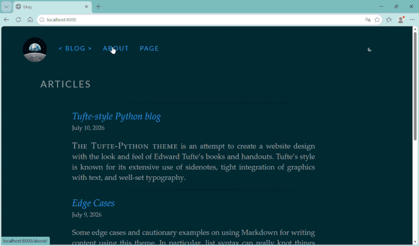
 <br>*A minimalistic Python powered blog. Live [demo](https://hyperphantasia.github.io/tufte-python).*

## Table of content

- [tufte-python](#tufte-python)
  - [Demo](#demo)
  - [Quick start](#quick-start)
  - [Incremental builds](#incremental-builds)
  - [Writing content](#writing-content)
    - [Posts](#posts)
    - [Pages](#pages)
    - [Content shortcodes](#content-shortcodes)
      - [Examples](#examples)
  - [Site configuration](#site-configuration)
  - [Theme](#theme)
    - [Dark mode](#dark-mode)
    - [Adding your own theme](#adding-your-own-theme)
    - [A note on accessibility](#a-note-on-accessibility)
  - [Deploying (CI/CD)](#deploying-cicd)
  - [Project layout](#project-layout)
  - [Differences from the original Jekyll theme](#differences-from-the-original-jekyll-theme)

## Quick start

```bash
pip install -r requirements.txt
python build.py            # builds the site into _site/
python build.py --serve    # build + serve at http://localhost:8000
python build.py --serve --watch   # also rebuild automatically on changes
```

Note on `--serve`:
- When you use `--serve`, it ignores the `baseurl` setting so links, images, and CSS work correctly on your computer. That’s because the local preview always runs from the main site address, not from a sub-folder.

- To preview the site exactly as it'll look once deployed, including the real `baseurl`, use:

```bash
python build.py --serve --production-urls
```

A plain `python build.py` (no `--serve`) always uses the real `baseurl` from `config.yml` so it's ready for the GitHub Actions workflow runs.

## Incremental builds

Builds are incremental by default: a post or page is only re-rendered (shortcode expansion + Markdown conversion is the expensive part) if its own source file is **new**, **changed**, or its output has gone **missing**. This matters once a blog has more than a handful of posts, since re-rendering everything on every build stops scaling.

Editing a template, `config.yml`, or the generator's own code (`tufte_ssg/`) invalidates the *entire* cache and triggers one full rebuild automatically. Those can change how every page looks, so there's no safe way to build only "the changed part" when one of them changes. A fresh checkout (no `_site/`, no cache file, exactly what CI gets on every run) always does a full build too, since there's nothing to reuse yet.

```bash
python build.py            # incremental (the default)
python build.py --force    # ignore the cache, re-render everything
```

Deleting a post's source file removes its output on the next build rather than leaving it orphaned in `_site/`. Static assets (`static/fonts`, `static/img`, `static/js`, `static/css`) are copied incrementally too. Only new or changed files are touched, so an image-heavy blog doesn't re-copy its whole media library on every build.

The cache lives in `.tufte_cache.json` at the project root (already in `.gitignore`. It's a local build artifact, not something to commit or share between machines).

## Writing content

### Posts

Posts are *chronological*. They are dated piece of content.

Add a Markdown file to `content/posts/`, named `YYYY-MM-DD-slug.md`:

```markdown
---
title: "My New Post"
date: 2026-07-09 09:00:00
categories: notes
tags: [python, jekyll]
---
Regular *markdown* post content goes here.

<!--more-->

Everything after `<!--more-->` is left out of the homepage excerpt but is still part of the full post.
```

Posts are published at `/articles/{4-digit-year}/{slug}/` by default. This is **configurable** via `permalink` in `config.yml`.

### Pages

Pages are *structural*. They are standalone, timeless piece of content (like About or Contact).

1. Add a Markdown file to `content/pages/` (e.g. `content/pages/contact.md`).
2. It's published at `/{filename}/`. 

>[!TIP]
>Set `layout: full-width` in its front matter for a wide layout (no sidenotes/margin notes), or leave it as `layout: page` for the standard column width.

### Content shortcodes

Shortcodes are modeled after the [original theme's](https://clayh53.github.io/tufte-jekyll/articles/20/tufte-style-jekyll-blog) Liquid tags. 

> [!NOTE]
>Existing [tufte-jekyll](https://github.com/clayh53/tufte-jekyll/tree/master/_posts) posts can be dropped in unchanged:

```text







 \LaTeX-block-goes-here 
 \LaTeX-inline-goes-here 
```

Each `unique-id` just needs to be unique within a single page.

#### Examples

**Newthought** (all caps):  
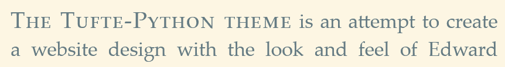

**Sidenote:**  
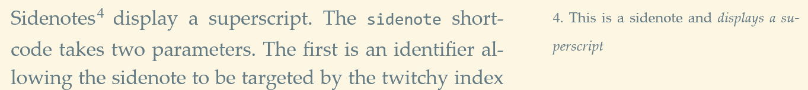

**Margin note:**  
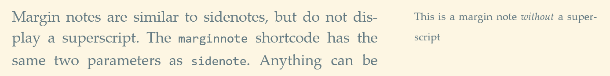

**Margin figure:**  
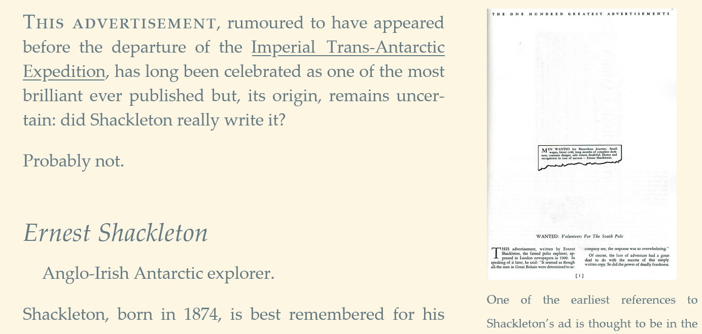

**Main column figure:**  


**Fullwidth figure:**  
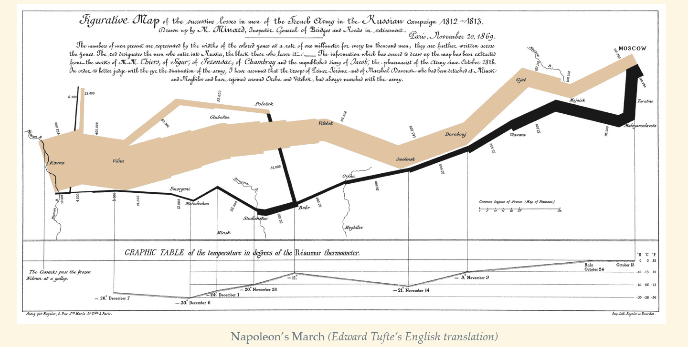

**Epigraphs:**  
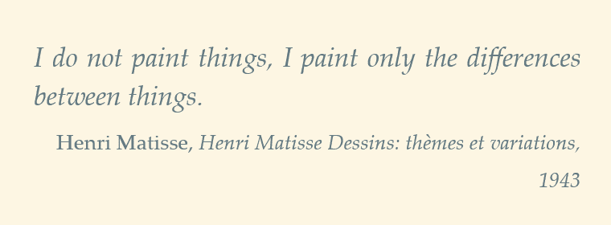

**LaTeX example:**  
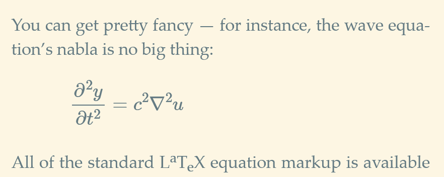

**Tables** (markdown or html):  
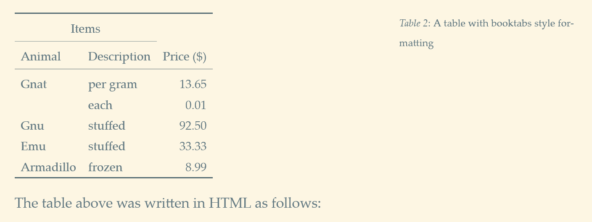

**Code snippets** (use backticks):  
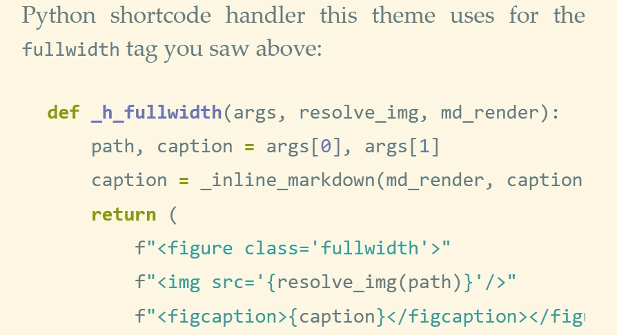

More [possibilities](https://hyperphantasia.github.io/tufte-python/articles/2026/tufte-style-python-blog) and [edge-cases](https://hyperphantasia.github.io/tufte-python/articles/2026/edge-cases) are handled as well.

## Site configuration

For a quickstart, edit these `config.yml` values at the repo root:

```yaml
title: An Amazing Title
url: "https://yourusername.github.io"
baseurl: "/your-repo-name"   # "" for a user/org page or custom domain
permalink: "/articles/{short_year}/{slug}/"
theme: solarized              # see "Theming" below for all options
social:
  - link: "//github.com/yourhandle"
    icon: icon-github # more is available
```

The configuration is organized into **site metadata**, **URL settings**, **content routing**, **visual theme**, **feature toggles**, and **social media links**.


| Option | Example value | Purpose |
|--------|---------------|---------|
| **title** | `tufte-python` | Main site title displayed in the header and metadata |
| **subtitle** | `Content-centric blogging` | Secondary tagline or site description shown in the header |
| **author** | `Your Name` | Author name for site attribution and metadata |
| **email** | `you@example.com` | Contact email address associated with the site |
| **description** | `A static site, generated with Python` | Full site description used in meta tags and RSS feeds |
| **url** | `https://user.github.io` | Complete domain where the site is hosted (no trailing slash) |
| **baseurl** | `/tufte-python` | Sub-path if site is in a subdirectory; leave blank for root domain or custom domains |
| **permalink** | `/articles/{year}/{slug}/` | URL structure for blog posts using placeholders like `{year}`, `{month}`, `{day}`, `{slug}` |
| **index_title** | `blog` | Navigation bar label for the home/blog index page |
| **badge_image** | `assets/img/python_logo.png` | Path to logo/badge image displayed in the header |
| **theme** | `solarized` | Color scheme; options include `solarized` variants, `dracula`, `gradianto-*` variants |
| **mathjax** | `true` | Enable LaTeX/mathematical equation rendering |
| **lato_font_load** | `true` | Load the [Lato font family](https://fonts.google.com/specimen/Lato) for typography |
| **justify_text** | `true` | Enable text justification in article content |
| **social** | Array of objects | List of social media links with `link` (URL) and `icon` (icon class) properties |


## Theme

`static/css/tufte.css` holds all the Tufte structure/typography rules and references colors only through CSS custom properties (`var(--color-text)`, `var(--syn-keyword)`, etc.). 
It never *hardcodes* a color itself. 

The actual color values come from a separate, swappable **theme** file in `static/css/themes/`, selected at build time via `config.yml`:

```yaml
theme: solarized
```

Available themes:
  
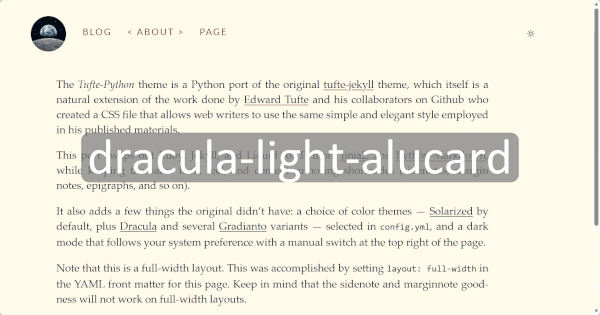

| `theme:` value             | Based on | Light/dark |
|---|---|---|
| `solarized` (default)      | [Solarized](https://ethanschoonover.com/solarized/) | both, follows system, toggle in footer |
| `solAArized` ([WCAG](https://www.w3.org/TR/WCAG20/) AA compliant)    | [SolAArized](https://github.com/paulcpederson/solAArized) | both, follows system, toggle in footer |
| `solarized-rainbow` (experimental)    | Solarized | both, follows system, toggle in footer |
| `dracula`                  | [Dracula](https://github.com/dracula/dracula-theme) (dark) + its official [Alucard](https://draculatheme.com/blog/dracula-pro-2.0-our-first-light-theme) palette (light) | both, follows system, toggle in footer |
| `gradianto-nature-green`   | [Gradianto](https://github.com/thvardhan/Gradianto) | dark only |
| `gradianto-dark-fuchsia`   | Gradianto | dark only |
| `gradianto-deep-ocean`     | Gradianto | dark only |
| `gradianto-midnight-blue`  | Gradianto | dark only |
| `gradianto-ultra-light`    | Gradianto | light only |


**Only the selected theme's CSS ships in the build**. It is copied to `_site/css/theme.css`. 

An unknown `theme:` value fails the build with a list of valid options (instead of silently falling back to something unexpected).

### Dark mode

For `solarized` variants and `dracula`, the site follows the visitor's OS-level light/dark preference (`prefers-color-scheme`) by default and shows a small switch in the top right corner for a manual override. 
The choice is remembered (`localStorage`) and applied before first paint, so there's no flash of the wrong theme on repeat visits.

The Gradianto variants are single-mode palettes with no official light or dark counterpart, for those, the switch is hidden automatically.

### Adding your own theme

1. Copy an existing file in `static/css/themes/` as a starting point and define the same set of `--color-*`/`--syn-*` custom properties.
2. For dual-mode palettes, inspire yourself by `solarized.css` structure or use `gradianto-nature-green.css` for a single mode palette.
3. In `config.yml`, point `theme:` at your new filename (without `.css`).
4. Add it to `TOGGLE_CAPABLE_THEMES` in `tufte_ssg/generator.py` if it supports both modes (light/dark).

### A note on accessibility

Solarized's light-mode body text (`base00` on `base3`) measures ~4.1:1 contrast, just under the [WCAG AA](https://developer.mozilla.org/en-US/docs/Web/Accessibility/Guides/Understanding_WCAG/Perceivable/Color_contrast) body-text threshold of 4.5:1.
This is an [inherent](https://github.com/paulcpederson/solAArized) property of Solarized's own design (chosen for reduced eye strain over maximum contrast), not something specific to this port. A WCAG 2.0 AA compliant variant (`SolAArized`) is available and tackles this issue.

Every other text/background and link/background pairing across all themes was checked and clears 4.5:1 and link colors clear at least 3:1, (the AA threshold for large text/UI elements).

>[!NOTE]
>`static/css/print.css` is unthemed on purpose. Printed pages stay plain black-on-white regardless of the active site theme, to save ink.

## Deploying (CI/CD)

`.github/workflows/deploy.yml` builds the site with Python and deploys the `_site/` output straight to GitHub Pages using GitHub's official Pages Actions.

To enable it:

1. Push this repo to GitHub.
2. In the repo's **Settings → Pages**, set "Source" to **GitHub Actions**.
3. Update `config.yml`'s `url`/`baseurl` to match your GitHub Pages URL.
4. Push to `main`. The workflow builds and deploys automatically.

## Project layout

```txt
.
├── config.yml                  # site configuration
├── content/
│   ├── posts/                  # blog posts (YYYY-MM-DD-slug.md)
│   └── pages/                  # standalone pages (slug.md)
├── templates/                  # Jinja2 templates (layouts + partials)
├── static/
│   ├── css/
│   │   ├── tufte.css           # structural CSS
│   │   ├── print.css           # structural CSS
│   │   └── themes/             # one file per selectable color theme
│   ├── js/                     # theme-toggle.js (dark-mode switch logic)
│   ├── fonts/                  # static assets, copied as-is
│   └── img/                    # static assets, copied as-is
├── tufte_ssg/                  # the generator itself
├── build.py                    # CLI: build / serve / watch
├── .tufte_cache.json           # Incremental build cache (gitignored, auto-created)
└── .github/workflows/          # GitHub Actions CI/CD
```

## Differences from the original Jekyll theme

- No Ruby/Gemfile/Jekyll: pure Python
- Config is a single `config.yml` instead of `_config.yml` + `_data/*.yml`.
- CSS is plain and checked in directly (`static/css/`) instead of being compiled from Sass on every build.
- Colors are pulled from a swappable theme file (`theme:` in `config.yml`) instead of being hardcoded.
- The original near-black-on-cream palette isn't one of the shipped options anymore. The new default is [Solarized](https://ethanschoonover.com/solarized/), with automatic dark mode and a footer toggle. See ["Theming"](#theme) above.
- MathJax loads only what it needs and the old `polyfill.io` script [was dropped](https://www.kaspersky.com/blog/polyfill-io-service-supply-chain-attacks/51635/).
- Text alignment options available: normal or justified text.
- **Everything else:** HTML structure, shortcode syntax, permalink scheme, RSS feed is intentionally kept the same.

♗
